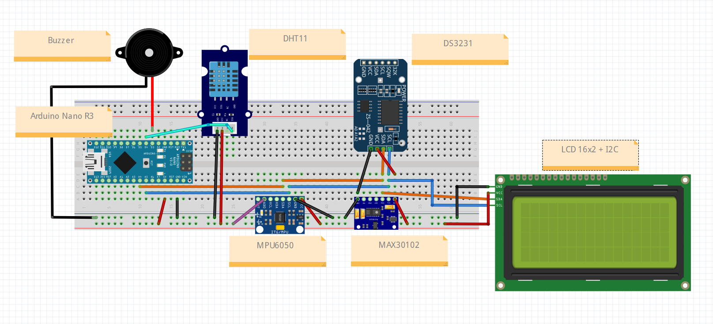
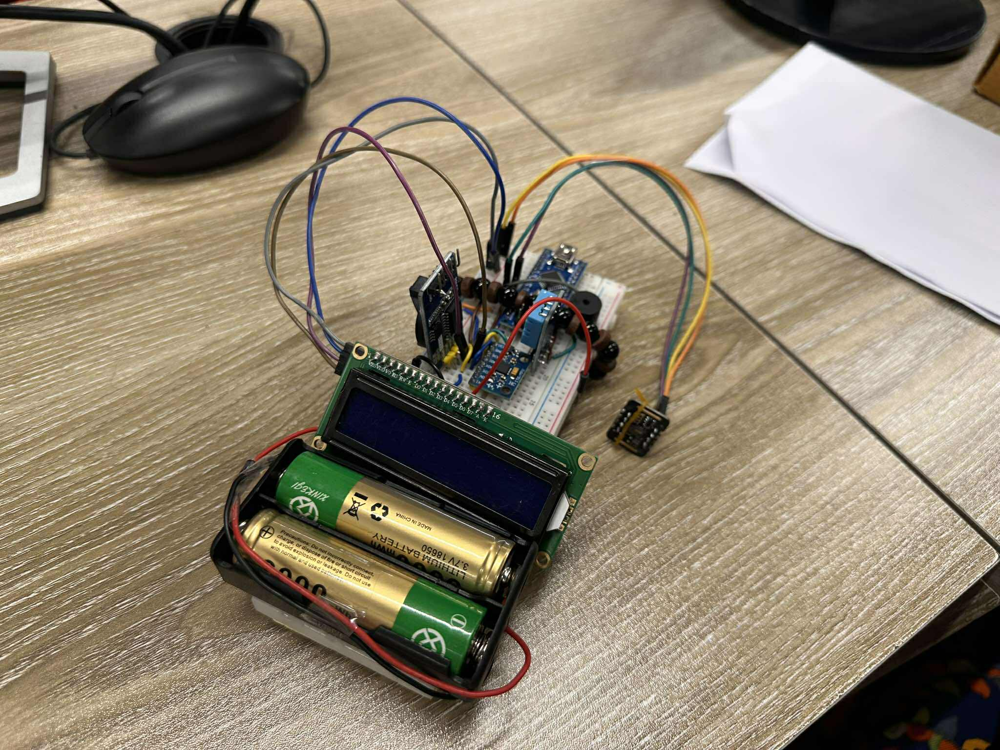
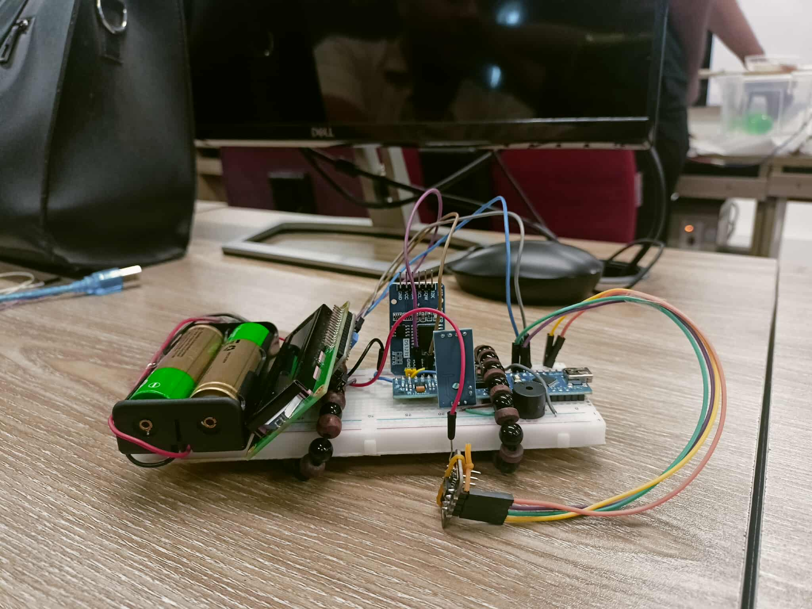
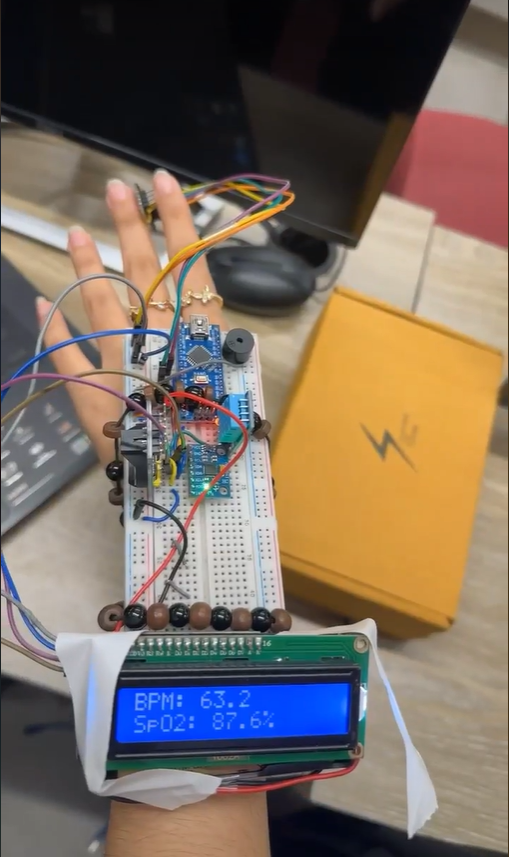

# Heal Watch 🩺  
An Arduino-based **health monitoring and alert system** that tracks vital signs in real time.  
This project was developed as part of the **CSE360: Computer Interface** course.

---

## 📖 Overview  
**Heal Watch** is a wearable/portable health monitoring device designed to assist patients and caregivers.  
It continuously measures vital health parameters and provides timely alerts for emergency or scheduled conditions.  
The system is built on Arduino Nano and integrates multiple sensors for health tracking, reminders, and safety monitoring.  

---

## 🔌 Hardware Components  
| Component        | Quantity | Purpose |
|------------------|----------|---------|
| Arduino Nano R3  | 1 | Main microcontroller |
| MAX30102         | 1 | Heart rate & SpO₂ sensor (I²C) |
| MPU6050          | 1 | Motion & fall detection (I²C) |
| DS3231           | 1 | Real-time clock for reminders (I²C) |
| DHT11 (3-pin)    | 1 | Temperature & humidity sensor |
| LCD 16x2 + I²C   | 1 | Display readings |
| Buzzer           | 1 | Alerts for abnormal conditions |
| Battery  | 1 | Portable power supply |

---

## 🔗 Communication Protocols  
- **I²C** → MAX30102, MPU6050, DS3231, LCD  
- **Digital pin** → DHT11, Buzzer  

---

## ⚡ Features  
- Continuous monitoring of:  
  - Heart rate & SpO₂  
  - Temperature & humidity  
- Fall detection with motion sensor  
- Medicine time reminder via RTC  
- Visual display of readings on LCD  
- Audible buzzer alerts for emergencies

---

## 📐 Circuit Diagram 

 

---

## 💻 Software Setup & Instructions  
1. **Install Arduino IDE** from Arduino website  
2. **Connect Arduino Nano** with USB cable.  
3. Install the following libraries in Arduino IDE:  
   - `Wire.h` (I²C communication)  
   - `MAX30105.h` (MAX30102 sensor)  
   - `heartRate.h`  
   - `Adafruit_MPU6050.h` (motion sensor)  
   - `RTClib.h` (DS3231 RTC)  
   - `DHT.h` (temperature sensor)  
   - `LiquidCrystal_I2C.h` (LCD)  
4. Copy the code and paste it into the Arduino IDE. 
5. Select **Board: Arduino Nano** and correct **Port** from Tools menu.  
6. **Upload the code** to your Arduino Nano.  
7. Power the project using a **USB cable** or a **3.7V battery**.  
8. Observe live data on LCD and buzzer alerts when thresholds are crossed.  

---

## 🔍 Visual Overview
<table>
  <tr>
    <td>
       
      
    </td>
    <td>
      
    </td>
  </tr>
</table>
